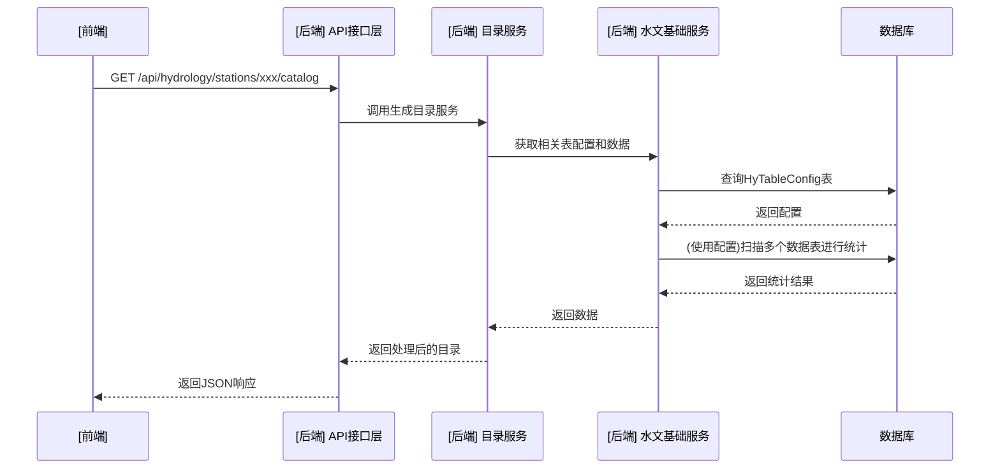

# 水文数据库应用系统 Brownfield 增强架构

**版本：** 1.0 (最终定稿)
**定稿日期：** 2025年8月21日
**架构师：** Winston (BMAD-Method Architect)

---

## 1. 引言 (Introduction)

本文档概述了在现有 `mayfly-go` 项目基础上，进行“水文数据库应用”功能增强的整体技术架构方案。本文档旨在为二次开发提供一个清晰、稳健的技术蓝图，确保新功能能够与现有系统无缝集成，并满足PRD中定义的所有需求。

本文档是对 `mayfly-go` 现有架构的补充和扩展，所有新组件的设计都将遵循其已建立的模式和规范。

### 1.1 现有项目分析 (Existing Project Analysis)

* **当前项目状态**:
    * **核心定位**: 一个功能强大的一体化运维管理平台。
    * **技术栈**: 后端采用 `Go` 语言，核心框架为 `Gin` (Web) 和 `GORM` (ORM)；前端为 `Vue 3` 技术栈，UI库为 `Element Plus`。
    * **架构风格**: 设计精良的**模块化单体 (Modular Monolith)**。其后端代码遵循了清晰的**分层架构**（API层、应用层、领域层、基础设施层），业务逻辑高度模块化。
    * **部署方式**: 普遍采用 `Docker` 容器化部署。

* **可用文档**:
    * 我们工作的核心依据是 `产品需求文档 (PRD) v1.2`。
    * 同时，我们参考了 `mayfly-go` 的开源社区文档和源码结构。

* **已识别的核心约束**:
    * **模式一致性**: 我们新增的“水文”功能**必须**作为一个新的独立模块（`hydrology`），遵循 `mayfly-go` 现有的分层和模块化模式进行开发。
    * **技术栈继承**: 我们**必须**沿用其核心技术栈。
    * **功能复用**: 我们应**最大程度地**复用 `mayfly-go` 已有的基础组件（认证、权限、数据库连接池、日志等）。

### 1.2 变更日志 (Change Log)

| 日期          | 版本 | 描述                               | 作者                |
| :------------ | :--- | :--------------------------------- | :------------------ |
| 2025年8月21日 | 1.0  | 经多轮协作与审议，完成架构设计并定稿。 | Winston (Architect) |

---

## 2. 增强范围与集成策略 (Enhancement Scope and Integration Strategy)

### 2.1 增强功能概述

* **增强类型**: 在现有的 `mayfly-go` 平台中，新增一个完整的、面向特定领域的“水文数据应用”功能集。
* **核心范围**: 实现PRD中定义的史诗1, 2, 3 的全部功能。
* **集成影响等级**: **中等 (Moderate)**。新增大量代码和一个独立的功能模块，但对 `mayfly-go` 现有核心代码的修改保持在最低限度。

### 2.2 集成方法 (Integration Approach)

* **代码集成策略**:
    * **后端**: 在 `server/internal` 目录下，创建一个全新的包 `hydrology`，所有后端逻辑内聚于此。
    * **前端**: 在 `frontend/src` 目录下，为 `views`, `components`, `router`, `store`, `api` 创建对应的 `hydrology` 子目录或文件。

* **数据库集成策略**:
    * 在现有数据库中新增 `HyTableConfig` 表。
    * 应用将**只读**用户现有的水文数据表，**绝不**修改其表结构。

* **API 集成策略**:
    * 所有新的API端点都将注册在 `/api/hydrology` 路由组下。

* **UI 集成策略**:
    * 在 `mayfly-go` 的主导航菜单中，新增“水文应用”顶级入口。
    * 所有新页面复用 `Element Plus` 和 `mayfly-go` 的现有样式。

### 2.3 兼容性需求 (Compatibility Requirements)

* **API 兼容性**: 新增路由不得与 `mayfly-go` 的API路由冲突。
* **数据库兼容性**: 必须与 `mayfly-go` 支持的所有主流数据库兼容。
* **UI/UX 兼容性**: 新功能模块的UI交互与视觉风格必须与主系统保持高度一致。
* **性能兼容性**: 所有耗时操作**必须**设计为后台异步任务，不能阻塞主应用。

---

## 3. 技术栈对齐 (Tech Stack Alignment)

### 3.1 现有技术栈的继承与使用

我们将完全继承 `mayfly-go` 的核心技术栈，并在此基础上进行功能开发。

| 类别       | 当前技术       | 在增强功能中的用途               |
| :--------- | :------------- | :------------------------------- |
| 后端语言   | Go             | 所有新后端逻辑的开发语言。       |
| Web框架    | Gin            | 所有新 `api/hydrology` 路由的实现框架。 |
| ORM库      | GORM           | 所有数据库操作的基础。           |
| 前端框架   | Vue 3          | 所有新水文功能页面的构建框架。   |
| 前端语言   | TypeScript     | 保证前端代码的类型安全和可维护性。 |
| UI组件库   | Element Plus   | 所有新UI组件都将基于此库构建。   |

### 3.2 新增技术依赖评估

建议在开发阶段考虑引入以下**非核心**的辅助库：

| 技术                     | 用途                                     | 理由                                       |
| :----------------------- | :--------------------------------------- | :----------------------------------------- |
| Go CSV库 (如 `gocsv`)    | 用于实现史诗2中的批量CSV文件导入功能。   | 可靠地处理复杂的CSV格式，简化数据解析代码。 |
| Go Time库 (如 `timeutil`) | 用于实现史诗3中数据目录的“断档”分析。 | 简化复杂的时间序列中断点分析逻辑。         |

### 3.3 版本控制策略 (Versioning Strategy)

* **核心原则**: 所有共享的核心依赖版本，必须与我们开始开发时所基于的 `mayfly-go` 主分支中定义的版本**保持完全一致**。
* **新增依赖**: 应选择与 `mayfly-go` 的核心依赖兼容的最新稳定版本。
* **更新策略**: 在一个开发周期中，不主动升级核心依赖版本，除非为了修复关键的安全漏洞。

---

## 4. 数据模型与库表结构变更

### 4.1 最终版 v1.5: `HyTableConfig` 表设计 (定稿)

此表是我们整个水文应用模块的核心驱动，用于将业务概念映射到物理数据结构。

| 字段名         | 数据类型       | 描述                             |
| :------------- | :------------- | :------------------------------- |
| `TableId`      | `INT`          | 主键, 自增                       |
| `TableName`    | `NVARCHAR(30)` | 物理数据表名                     |
| `TableCnName`  | `NVARCHAR(50)` | 数据表的中文业务名称             |
| `DataType`     | `NVARCHAR(10)` | 水文要素编码 (如: 'Q', 'S')    |
| `DataTypeCnName`| `NVARCHAR(50)`| **(新增)** 水文要素中文名 (如: '流量') |
| `TableType`    | `NVARCHAR(10)` | 时间尺度编码 (如: 'C', 'D')    |
| `StcdField`    | `NVARCHAR(20)` | 表中“测站编码”的字段名           |
| `ValueField`   | `NVARCHAR(20)` | 表中“数值”的字段名               |
| `TimeField`    | `NVARCHAR(20)` | **(可为空)** 单一时间字段的名称    |
| `YearField`    | `NVARCHAR(20)` | **(可为空)** 年份字段的名称        |
| `MonthField`   | `NVARCHAR(20)` | **(可为空)** 月份字段的名称        |
| `YearCount`    | `INT`          | **(可为空)** 数据覆盖的年份总数 (缓存) |
| `DataCount`    | `BIGINT`       | **(可为空)** 数据总条数 (缓存)     |
| `Notes`        | `NVARCHAR(255)`| **(可为空)** 备注                |

### 4.2 库表结构集成策略

* **迁移策略**: 我们将在 `hydrology` 模块中定义 `HyTableConfig` 的GORM模型，并将其注册到 `mayfly-go` 的主程序`AutoMigrate`函数中，实现自动建表。
* **向后兼容性**: **完全兼容**。只增不改的策略确保了对现有系统的绝对安全。

---

## 5. 组件架构

### 5.1 新增核心组件

#### 后端组件 (位于 `server/internal/hydrology` 包内)
* **共享基础服务**: `HydrologyService` (作为模块中枢，封装通用逻辑)
* **上层应用服务**:
    * `QueryEngine` (负责核心的动态查询逻辑)
    * `BatchProcessor` (负责异步的批量数据维护任务)
    * `CatalogService` (负责数据目录的生成与统计)
    * `QualityCheckEngine` (负责质量检查规则的生成、管理和执行)
    * `ApiLayer` (负责暴露所有服务的API接口)

#### 前端组件 (位于 `frontend/src/views/hydrology` 等专属目录内)
* `DataWorkbenchView` (父组件/容器), 包含 `ElementSelector`, `TimeControls`, `DataTable` 等子组件。
* `StationSearchView`, `BatchWizardView` 等其他视图组件。
* `ApiClient` (封装所有与后端API通信的客户端)。

### 5.2 组件交互关系图


-----

## 6\. API 设计与集成

### 6.1 API 集成策略

  * **统一路由前缀**: `/api/hydrology`
  * **认证与授权**: 复用 `mayfly-go` 的用户认证中间件。
  * **版本控制**: 初期不引入API版本号。

### 6.2 核心API端点设计 (针对史诗1)

  * **`GET /api/hydrology/stations`**: 搜索测站。
  * **`GET /api/hydrology/stations/{stcd}/elements`**: 获取测站可用要素列表，响应中包含`isDefault: true`标志。
  * **`GET /api/hydrology/stations/{stcd}/data`**: 查询测站数据，**包含分页参数** (`page`, `pageSize`)。

-----

## 7\. 源码树集成

### 7.1 新增文件与目录组织

我们所有的新增代码都将严格限制在为“水文应用”模块创建的专属目录中。

```plaintext
mayfly-go/
├── frontend/
│   ├── src/
│   │   ├── api/
│   │   │   └── hydrology.ts       # (新增)
│   │   └── views/
│   │       └── hydrology/         # (新增)
└── server/
    ├── internal/
    │   ├── hydrology/             # (新增)
    │   │   ├── api/
    │   │   ├── application/
    │   │   ├── domain/
    │   │   └── infrastructure/
    └── ...
```

### 7.2 集成准则

1.  **严格隔离**: 所有代码必须存放在 `hydrology` 专属目录内。
2.  **最小化修改**: 除主文件中的模块注册外，严禁修改 `hydrology` 目录之外的任何现有业务代码。
3.  **遵循惯例**: 新代码的风格和模式必须遵循 `mayfly-go` 的现有惯例。

-----

## 8\. 基础设施与部署集成

### 8.1 部署策略

  * **核心部署方法**: 部署过程即是**使用包含了我们新代码的新版本 `mayfly-go` 容器镜像，去替换旧版本的容器镜像**。
  * **基础设施变更**: **无**。
  * **CI/CD流水线集成**: 在现有流水线的测试阶段，加入针对 `hydrology` 模块的测试命令。

### 8.2 回滚策略

  * **主要回滚方法**: **重新部署上一个稳定版本的容器镜像**。
  * **风险缓解**: 建议在生产环境采用**蓝绿部署**或**金丝雀发布**策略。

-----

## 9\. 编码标准与惯例

### 9.1 现有标准符合性

  * **后端 (Go)**: 强制使用 `gofmt`，遵循 `golangci-lint` 规范，必须检查所有 `error`。
  * **前端 (Vue / TypeScript)**: 强制使用 `ESLint` + `Prettier`，组件必须使用 `<script setup lang="ts">` 风格，样式必须 `scoped`。

### 9.2 针对AI代理的特别编码准则

1.  **极致的显式化**: 强制所有变量、参数和返回值都拥有明确的TypeScript类型，严禁使用`any`。
2.  **模式的可预测性**: 优先使用步骤清晰的`for`循环，而不是复杂的单行函数式链。
3.  **逻辑的自包含性**: 强制使用显式依赖注入，严禁使用全局状态。
4.  **“Why”驱动的注释**: 对非显而易见的业务逻辑，必须添加注释解释“为什么这么做”。

-----

## 10\. 测试策略

### 10.1 集成与新增要求

  * **集成**: 完全采用 `mayfly-go` 项目现有的测试框架和组织方式。
  * **单元测试**: 所有新增的后端服务和前端组件都必须有单元测试，后端新代码覆盖率不低于80%。
  * **集成测试**: 重点测试API调用链和 `BatchProcessor` 的事务性。
  * **回归测试**: **强制要求**。CI/CD中必须完整运行 `mayfly-go` 自身的全量测试套件，任何失败都将阻断发布。

-----

## 11\. 安全集成

### 11.1 核心要求

  * **认证**: 所有新增API**必须**应用 `mayfly-go` 的认证中间件。
  * **授权**: 对新功能进行权限分级，高风险的“批量维护工具”**必须**限制只有管理员角色才能访问。
  * **输入验证**: 后端**必须**对所有API输入和上传文件内容进行严格校验。
  * **可观测性**: 所有安全事件和审计日志都必须是结构化的JSON格式，并能被外部日志系统采集。
  * **资源隔离**: 所有耗时长的后台任务**必须**在有资源限制的Go协程池中执行，避免冲垮主应用。

-----

## 12\. 清单检查结果报告

### 执行摘要

  * **项目类型**: 棕地全栈增强 (Brownfield Full-Stack Enhancement)
  * **架构就绪状态**: **高度就绪 (High)**
  * **结论**: 本架构文档与PRD高度对齐，考虑周全，是一份可以指导后续开发工作的、高质量的技术蓝图。

### 最终建议

**批准 (APPROVED)**: 本架构设计已准备就绪，可以交付给开发团队。建议在史诗1的第一个故事中，包含一个**技术勘探子任务**，用于最终确认将前端模块无缝注册到 `mayfly-go` 主应用中的最佳技术路径。

